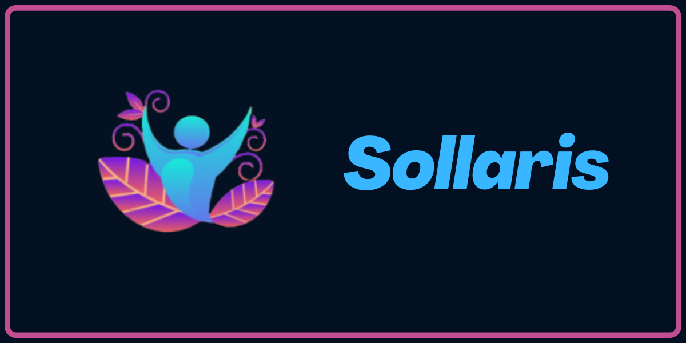

# 📌 Sobre o projeto

 📍 O aplicativo Sollaris nasceu com a ideia de otimizar e gerenciar os produtos das empresas que estarão na vitrine do nosso site.

 📍 O objetivo deste trabalho é desenvolver um aplicativo móvel inovador que atenda às necessidades dos usuários empresas, proporcionando uma solução eficaz para cadastrar e gerenciar os seus produto. Além disso, o objetivo é avaliar a eficácia do aplicativo por meio de testes de usabilidade e feedback dos usuários, visando aprimorar continuamente sua experiência e funcionalidades.


# 📌 Tecnologias utilizadas

## 📲 Mobile
- Flutter
- Dart


# 📌  Como executar o projeto

## 📲 Mobile


```bash
# clonar repositório
git clone https://github.com/SENAIMARKETPLACE/

# entrar na pasta do projeto back end
cd mobile

# instalar dependências
flutter clean
flutter pub get
```


